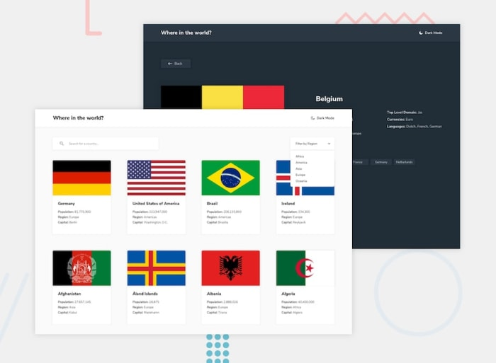

# REST Countries API with color theme switcher solution

This is a solution to the [REST Countries API with color theme switcher challenge on Frontend Mentor](https://www.frontendmentor.io/challenges/rest-countries-api-with-color-theme-switcher-5cacc469fec04111f7b848ca). Frontend Mentor challenges help you improve your coding skills by building realistic projects. 

### The challenge

Users should be able to:

- See all countries from the API on the homepage
- Search for a country using an input field
- Filter countries by region
- View details of country
- Toggle the color scheme between light and dark mode (optional)

### Screenshot

### Links
- [Live Site URL](https://aishwarya-dhuri.github.io/Frontend-mentor-challenges/Countries-RestApi-JsApp/index.html)

- [Solution URL](https://github.com/Aishwarya-Dhuri/Frontend-mentor-challenges/tree/master/Countries-RestApi-JsApp)

## Author

- Website - [Portfolio website](https://aishyawebportfolio.netlify.app/)
- Linkedin - [@aishwarya-dhuri](https://in.linkedin.com/in/aishwarya-dhuri)
- Instagram - [@miss_aishya](https://www.instagram.com/miss_aishya/)

